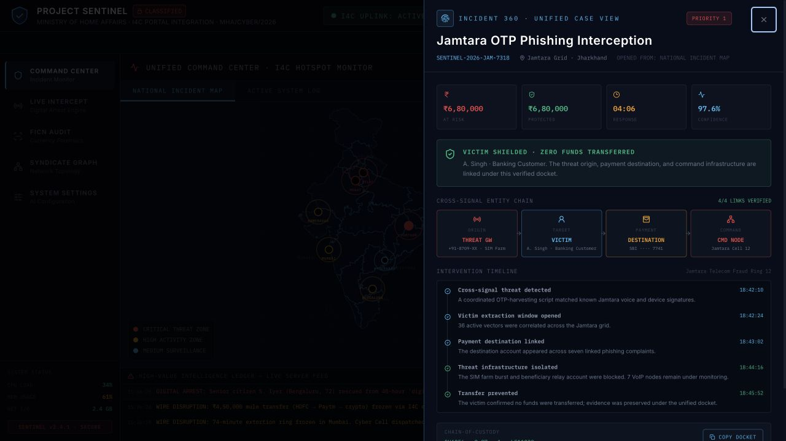
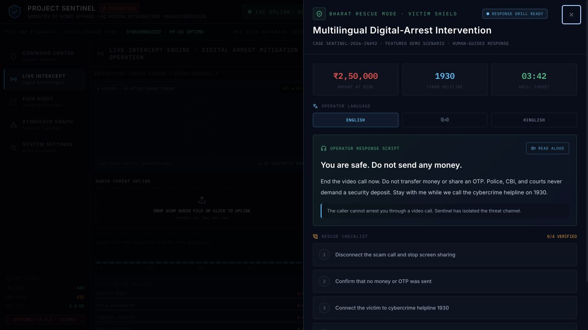
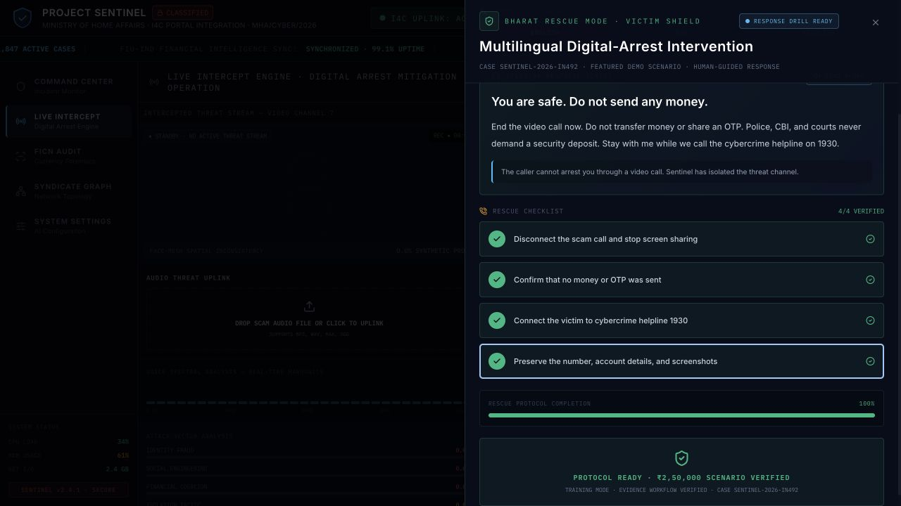

# Incident 360 and Bharat Rescue Mode

## Incident 360 — selected hotspot

Selecting Jamtara on the national incident map now opens its matching case, metrics, entity chain, timeline, and verified chain of custody.

## Bharat Rescue Mode — honest drill state

Before a live extraction signal is detected, the interface clearly identifies the featured scenario as a response drill while still demonstrating English, Hindi, and Hinglish guidance.

## Completed rescue workflow

The verified completion state confirms that all four operator actions and the evidence workflow were completed for the training scenario.

