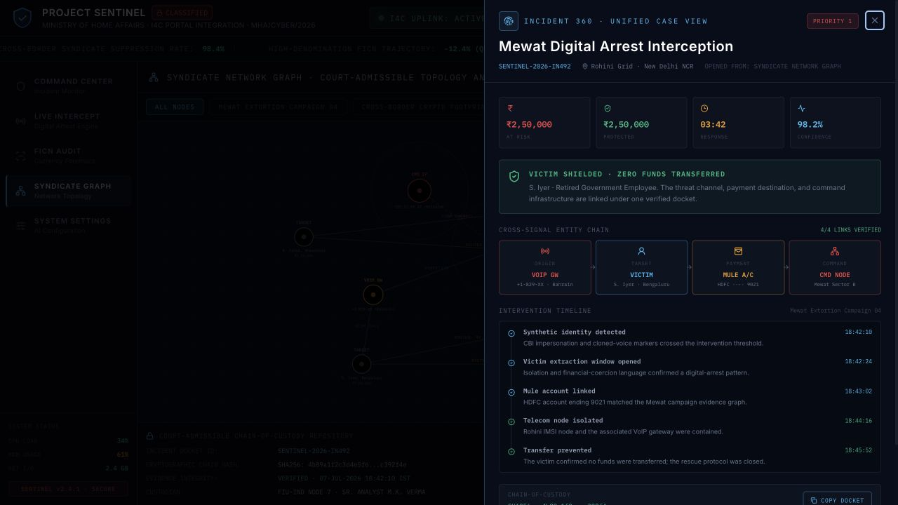
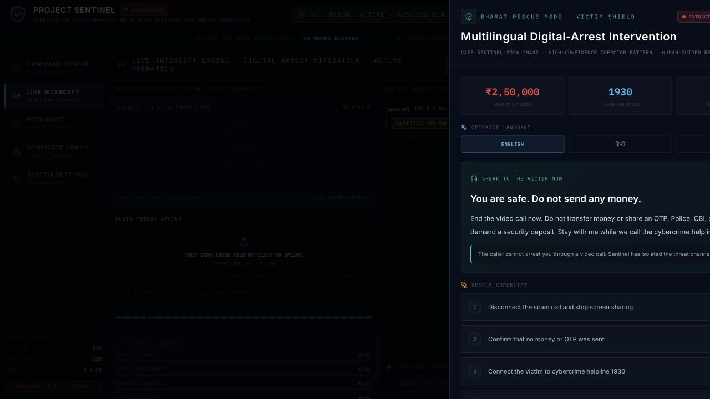
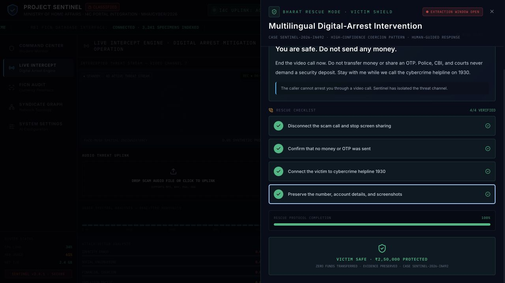

# Incident 360 and Bharat Rescue Mode

## Incident 360

Unified case intelligence shown over the syndicate graph, including impact metrics, the cross-signal entity chain, intervention timeline, and verified chain of custody.

## Bharat Rescue Mode

Multilingual operator guidance for live victim intervention, with English, Hindi, and Hinglish scripts and a four-step rescue checklist.

## Completed rescue workflow

The verified completion state records that the victim is safe, the evidence is preserved, and the transfer was prevented.

